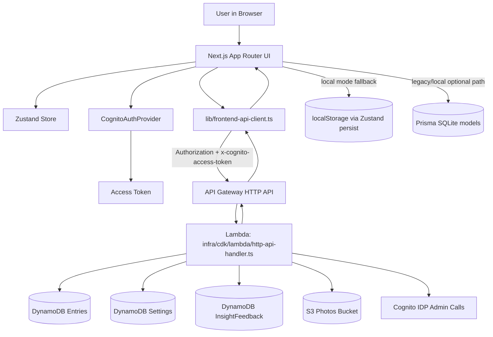

# Ojas-Health Architecture Audit (P0.1)

## Repository map

- `app/` — Next.js App Router entrypoints, pages, and route handlers.
- `components/` — UI components for dashboard, auth, and UI primitives.
- `hooks/` — client hooks for state actions and date helpers.
- `lib/` — shared domain logic, API client, auth utilities, Zustand store, and insights.
- `infra/cdk/` — AWS CDK stack and Lambda backend implementation.
- `prisma/` — local/legacy Prisma schema + migrations (SQLite default).
- `tests/unit/` — Vitest unit tests.
- `tests/e2e/` — Playwright end-to-end tests.
- `docs/` — project docs and environment notes.
- `amplify.yml` — Amplify build spec (`npm ci`, `npm run build`, static artifacts from `out`).

## Framework and runtime summary

- **Frontend framework:** Next.js 16 App Router (`next`, `react`, `react-dom`).
- **Language/tooling:** TypeScript + ESLint + Tailwind CSS + PostCSS.
- **UI libs:** `framer-motion`, `lucide-react`, `recharts`.
- **Client state:** Zustand (`lib/store.ts`).
- **Validation/domain utils:** `zod`, custom `lib/*` modules.
- **Tests:** Vitest (`tests/unit`), Playwright (`tests/e2e`).
- **Deploy target:** AWS Amplify static hosting (`out` directory) plus optional AWS API backend.
- **Backend runtime:** AWS Lambda (Node.js 20 via CDK `NodejsFunction`) behind API Gateway HTTP API.
- **Auth provider:** AWS Cognito (user pool + JWT authorizer + client-side Cognito auth provider).
- **Storage/databases in active cloud path:**
  - DynamoDB tables: `Entries`, `Settings`, `InsightFeedback`
  - S3 bucket for photos
- **Secondary/legacy local data path:** Prisma schema with SQLite (`User`, `UserSettings`, `DailyEntry`) for local/legacy mode.
- **Python surface present:** `app.py` + `requirements.txt`, not part of the primary Next.js runtime path.

## Root config files reviewed

- `package.json`
- `README.md`
- `next.config.mjs`
- `amplify.yml`
- `infra/cdk/cdk.json`
- `prisma/schema.prisma`
- `vitest.config.ts`

## Existing API routes

### Next.js app route handlers

- `GET /api/auth/[...nextauth]`
- `POST /api/auth/[...nextauth]`

### AWS HTTP API routes (secured JWT routes in CDK)

- `GET /entries`
- `PUT /entries`
- `DELETE /entries`
- `GET /settings`
- `PATCH /settings`
- `GET /stats`
- `POST /metrics/page-view`
- `POST /photos/upload-url`
- `GET /admin/users`
- `GET /v2/insights`
- `POST /v2/insights/feedback`

## Existing DB tables/collections and fields

## Active cloud data model (DynamoDB via CDK)

### `Entries` table

- **Partition key:** `userId` (string)
- **Sort key:** `date` (string)
- **Stored item fields used by Lambda:**
  - `id`
  - `userId`
  - `date`
  - `morningWeight`
  - `nightWeight` (optional)
  - `calories` (optional)
  - `protein` (optional)
  - `steps` (optional)
  - `sleep` (optional)
  - `lateSnack` (boolean)
  - `highSodium` (boolean)
  - `workout` (boolean)
  - `alcohol` (boolean)
  - `photoUrl` (optional)
  - `notes` (optional)

### `Settings` table

- **Partition key:** `userId` (string)
- **Stored item fields used by Lambda:**
  - `userId`
  - `goalWeight`
  - `startWeight`
  - `targetDate`
  - `unit` (`kg`/`lbs`)
  - analytics meta row also uses:
    - `pageViews`
    - `updatedAt`

### `InsightFeedback` table

- **Partition key:** `userId` (string)
- **Sort key:** `insightTs` (string)
- **Stored item fields:**
  - `userId`
  - `insightTs`
  - `insightId`
  - `vote` (`up`/`down`)
  - `ts`

## Local/legacy Prisma data model (`prisma/schema.prisma`)

### `User`

- `id` (PK)
- `name` (nullable)
- `email` (unique)
- `passwordHash` (nullable)
- `createdAt`

### `UserSettings`

- `userId` (PK, FK to `User`)
- `goalWeight`
- `startWeight`
- `targetDate`
- `unit`
- `updatedAt`

### `DailyEntry`

- `id` (PK)
- `userId` (FK to `User`)
- `date`
- `morningWeight`
- `nightWeight` (nullable)
- `calories` (nullable)
- `protein` (nullable)
- `steps` (nullable)
- `sleep` (nullable)
- `lateSnack`
- `highSodium`
- `workout` (default false)
- `alcohol` (default false)
- `photoUrl` (nullable)
- `notes` (nullable)
- unique index on (`userId`, `date`)

## Existing React components (`components/`)

- `AboutButton.tsx`
- `AboutModal.tsx`
- `AIInsights.tsx`
- `AdminUsersPanel.tsx`
- `AppFooter.tsx`
- `AuthBar.tsx`
- `CognitoAuthProvider.tsx`
- `DailyInput.tsx`
- `DashboardKpiRow.tsx`
- `FeedbackButton.tsx`
- `HealthBootstrap.tsx`
- `HealthDashboard.tsx`
- `LoginForm.tsx`
- `LoginLanding.tsx`
- `PastDayGrid.tsx`
- `PhotoTracker.tsx`
- `Providers.tsx`
- `StoreHydration.tsx`
- `ThemeToggle.tsx`
- `TodayActivityCard.tsx`
- `WeightChart.tsx`
- `WeightHistoryTable.tsx`
- `ui/Badge.tsx`
- `ui/Card.tsx`
- `ui/InputField.tsx`
- `ui/Toggle.tsx`

## Request flow (dashboard → backend → DB)

## Notes and constraints discovered

- Amplify runs static build (`next build`) and publishes `out`; this requires API route code to compile even if runtime path is external.
- The product currently supports two data paths:
  - local browser mode (`NEXT_PUBLIC_USE_AWS_BACKEND=false`)
  - AWS backend sync mode (`NEXT_PUBLIC_USE_AWS_BACKEND=true` + API URL).
- Cognito JWT auth is required for cloud API routes; frontend passes token in both `Authorization` and `x-cognito-access-token`.

## Open questions before new feature work

1. Should Prisma/SQLite remain an actively supported path, or should all new schema work target only DynamoDB/CDK?
2. For API inventory governance, should we treat Lambda HTTP API routes as the canonical backend contract and avoid adding new Next.js API routes unless strictly needed?
3. Is the long-term deployment target still Amplify static export + API Gateway, or is there a planned move to a fully server-rendered Next deployment model?
